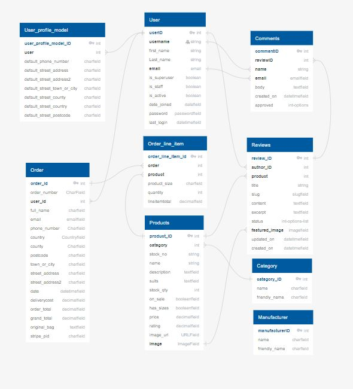
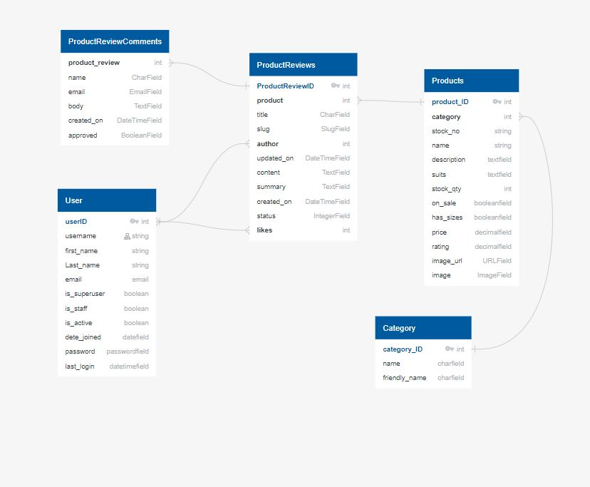
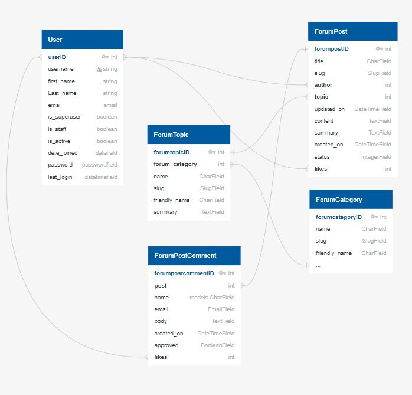
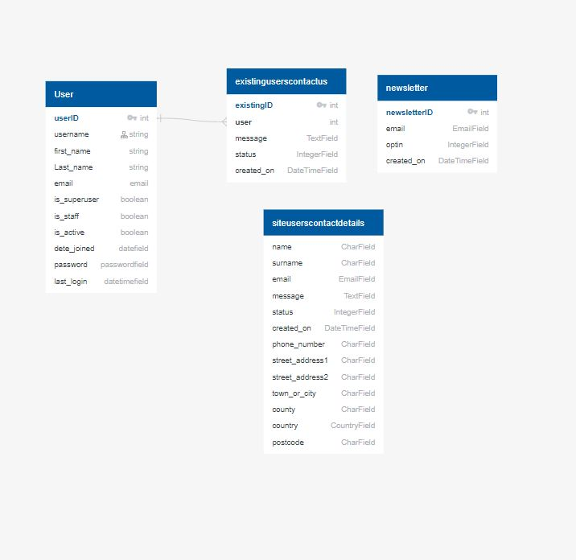

# ERD DIAGRAM

#### ERD diagram 1
### This diagram illustrates the relationship between the relevant databases relating to the main shop

#### ERD diagram 2
### This diagram illustrates the relationship between the relevant databases relating to the Product Reviews

#### ERD diagram 3
### This diagram illustrates the relationship between the relevant databases relating to the Forum

#### ERD diagram 4
### This diagram illustrates the relationship between the relevant databases relating to the Contact us and newsletter 
