# AWS Amazon Web Services S3 Bucket and IAM setup 

1. Create an account at aws.amazon.com

2. Open the S3 application and select the create bucket button to begin creating your bucket.
 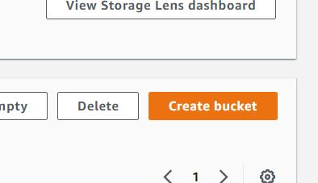

3. Open the S3 application and create an S3 bucket named as per your project name
 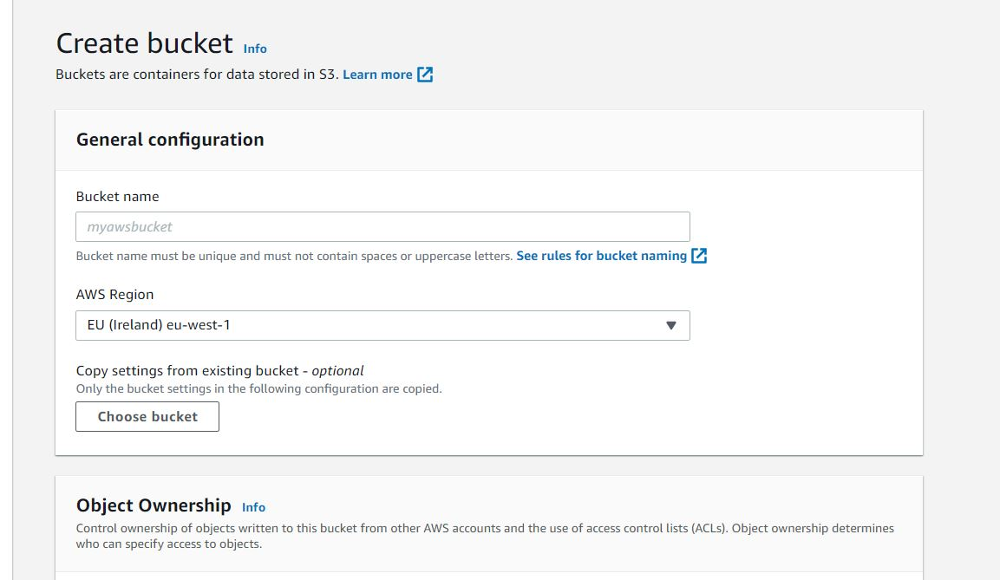

4. Uncheck the "Block All Public access setting"
 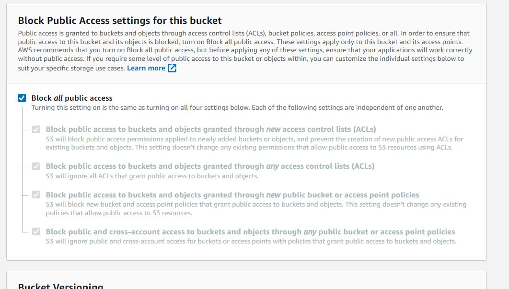

5. Select the acknoledgement allowing public access to your bucket
 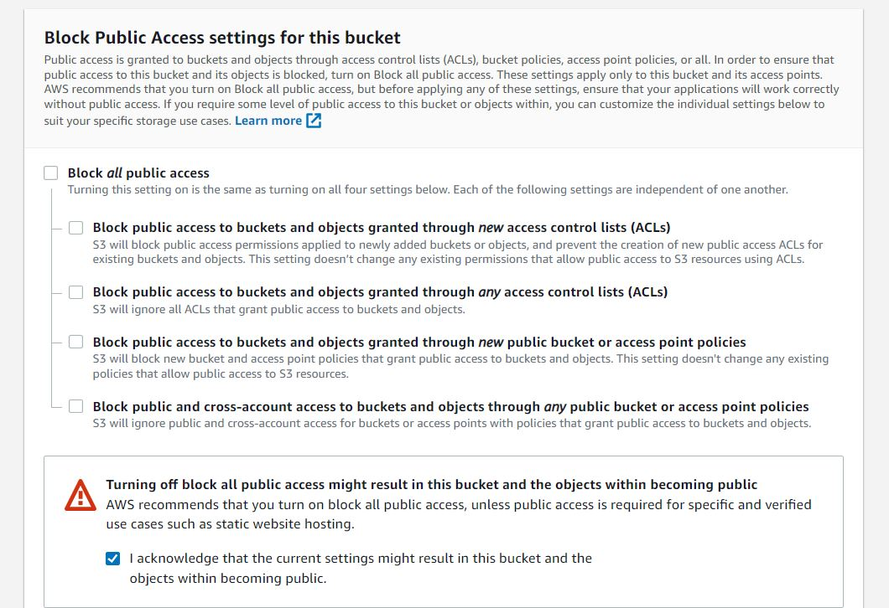

6. Select the Create Bucket button to create your bucket.
 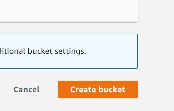

7. The bucket is created, the next step is to open the IAM application to set up access so navigate to IAM from the main menu. On the Iam Dashboard select identity and access amnegement and select user groups.
 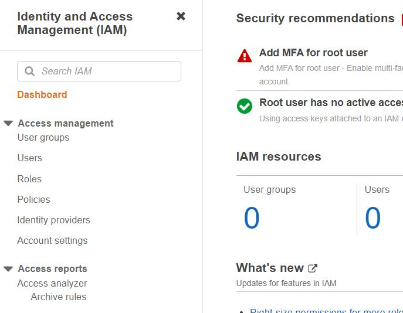

8. On the Iam Dashboard select create user group.
 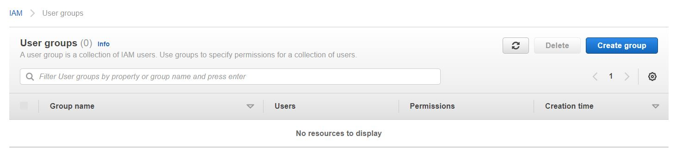

9. So next is to select create group button.
  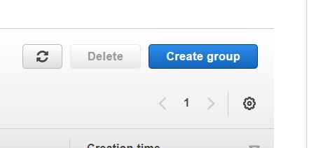

10. Create a new user group named as per your repository or project name.
 

11. Select Create group to finalise and create your group.
 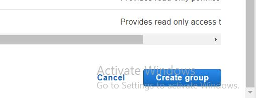

12. Next we add a user to the group

13. Select the user tab to add a user to the group.
 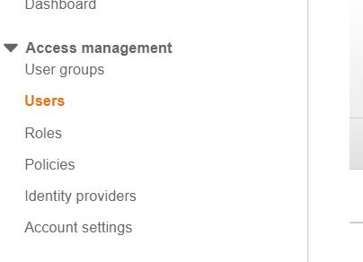

14. We then select add users
 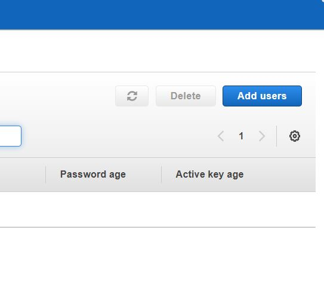

15. We then set the users details
 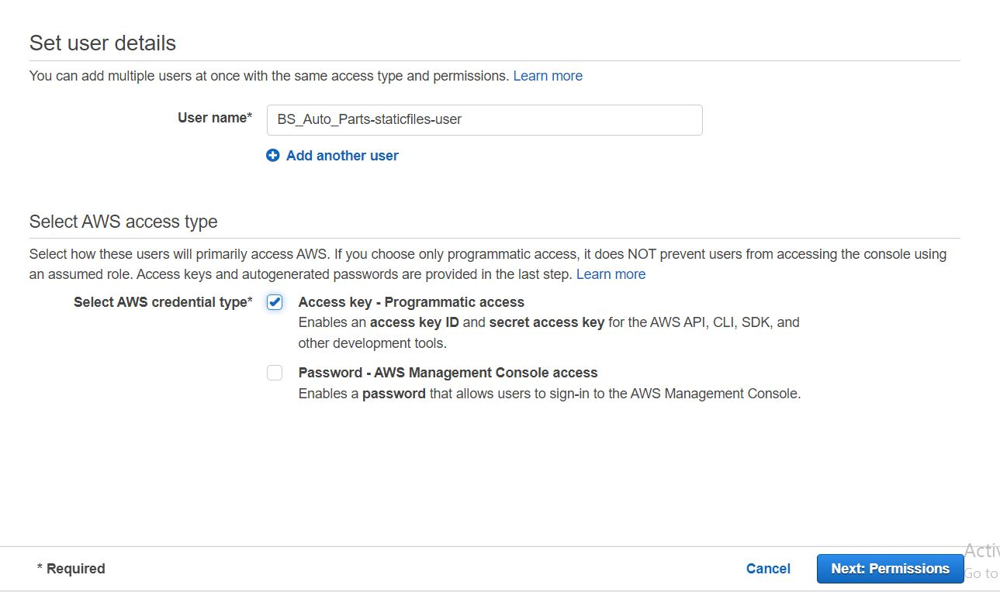

16. We then select add user to group and select checkbox next to your user and select 'Next tags' to continue
 

17. Select the next tags button to continue.
 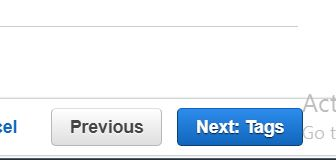

18. We then select the next review button as we do not need to make any additional changes.
 

19. We then select the create user button to create our user.
 

20. We should see a success message indicating that our user has been created succesfully.
 

21. We then have access to our users .csv file which we download as this contains the users access keys. Note the AWS_SECRET_ACCESS_KEY and AWS_ACCESS_KEY_ID variables, they are used in other parts of this README for local deployment and Heroku setup
 

22. We now select the policies selector.
 

23. Next we select the create new policy button to create a new policy
 

24. below is the new policy creation form
 

25. Next we select the JSON tab at the top.
 

26. Next we select import managed policy.
 

27. Next we select import s3 full access policy. 
 

28. Next we select edit resource and add our own custom script.
 

29. Below is the updated resource.
 

30. Next we navigate to the next tags button.
 

31. Next we give our policy a name and description.
 

32. Next we select the Create new policy button.
 

33. next we navigate to the user groups and permissions tab to attach the new policy.
 

34. Next we select the add permissions button
 

35. Next we should see our newly added policy.
 

36. Next we navigate to our workspace and update the settings.py file in the top level of our project.
 

