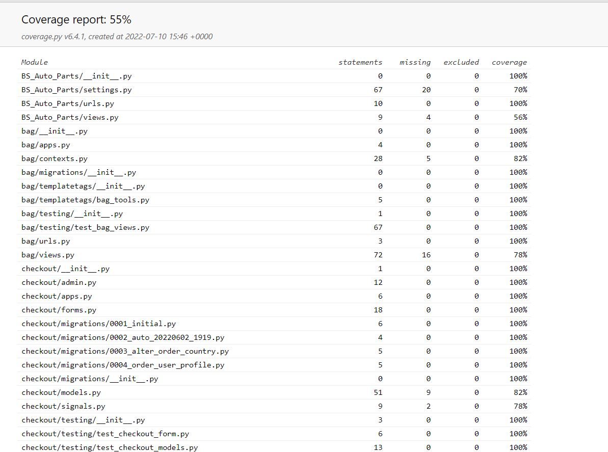
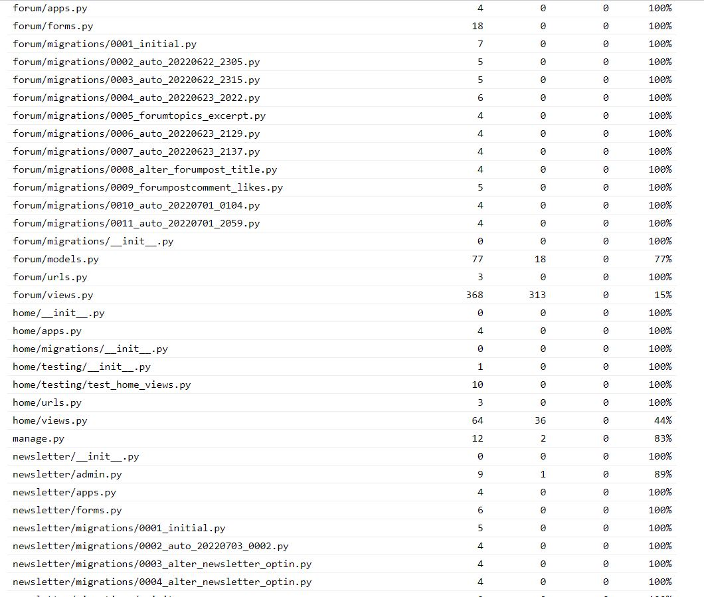
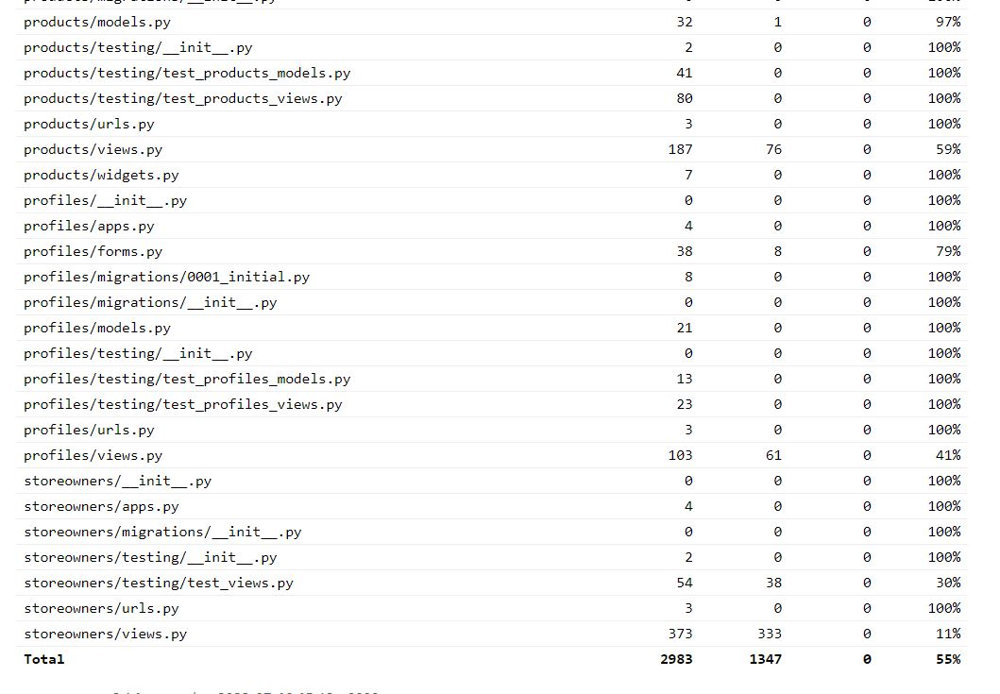

# COVERAGE TEST RESULTS

A significant number of tests have been carried out however due to time constraints no all tests have been carried out to achieve full coverage however this can be implemented in a future update of the web application. An overall coverage of 55% has been achieved .

