# Setting up gmail to send messages

## Google emails
To set up the project to send emails using a Google account the following steps are required
1. Create an email account at google.com, login, navigate to Settings in your gmail account and then click on Other Google Account Settings
     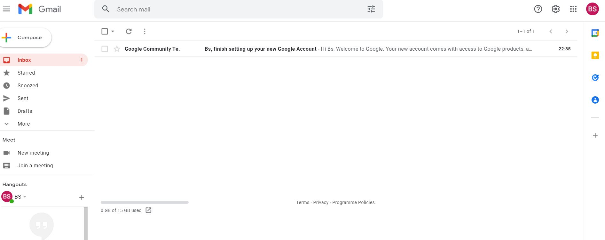
     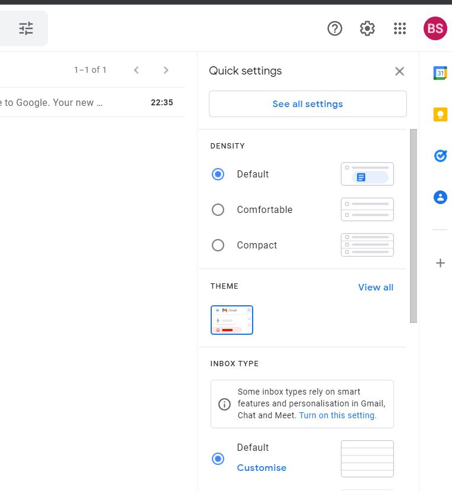
     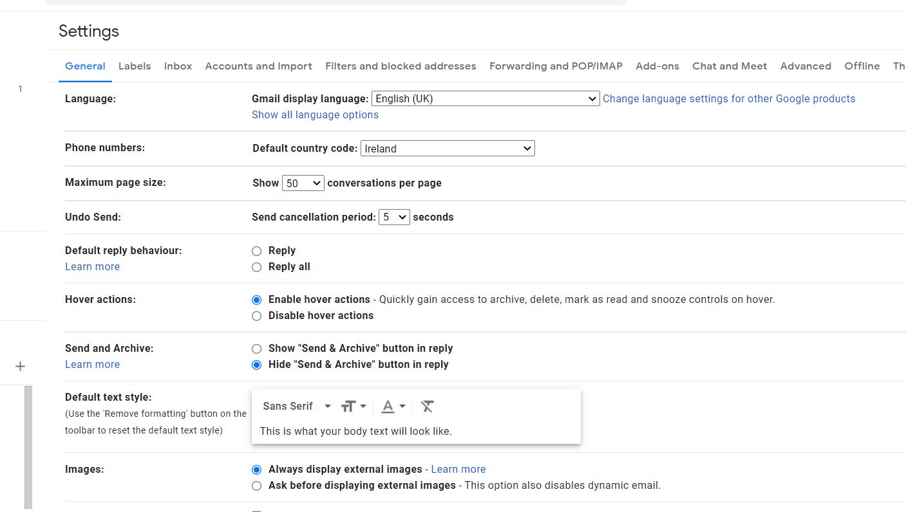
     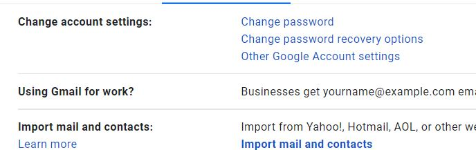
     
     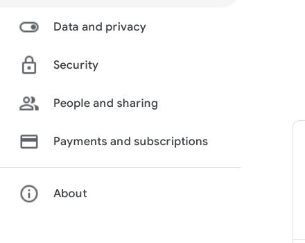

2. Turn on 2-step verification and follow the steps to enable
     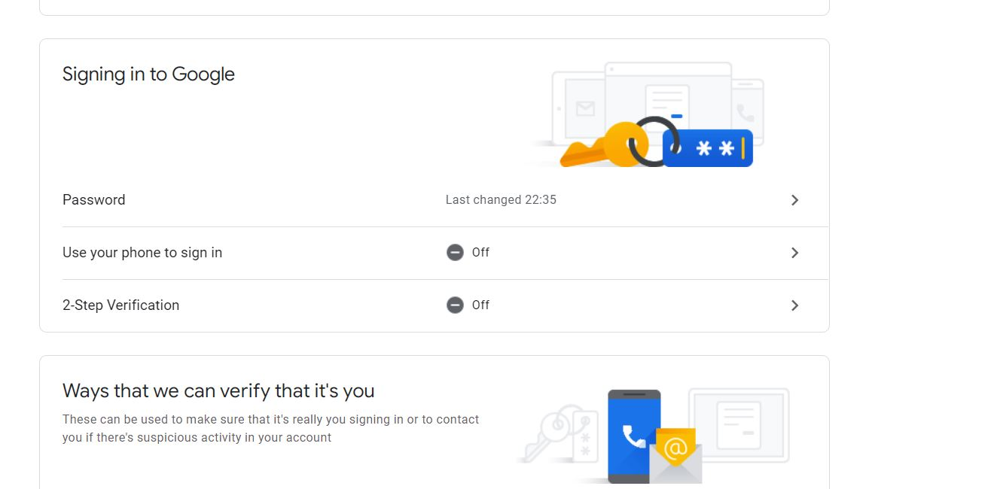

     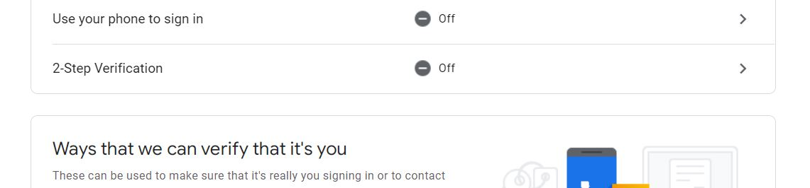

     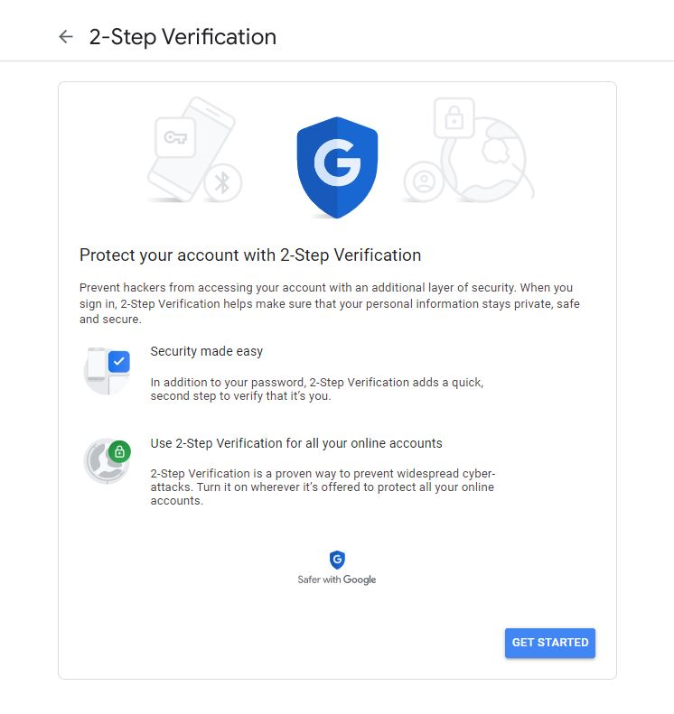

     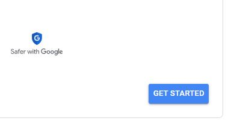

     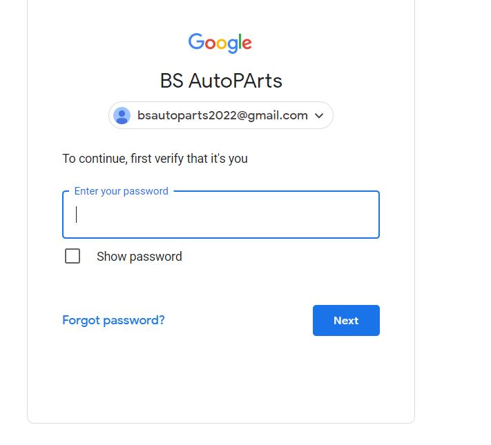

     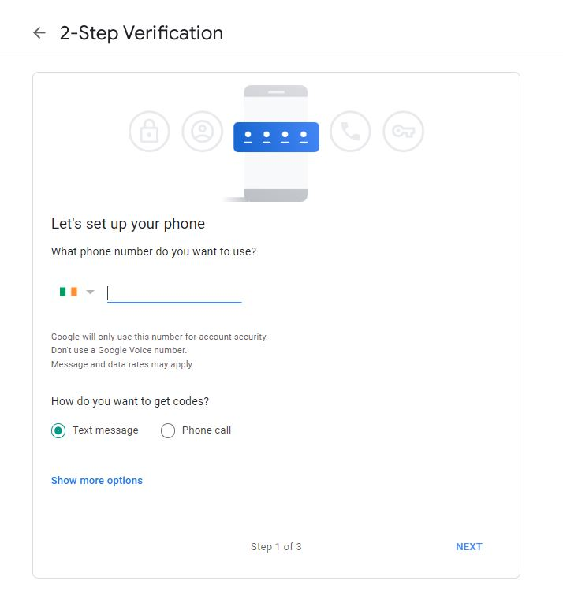
     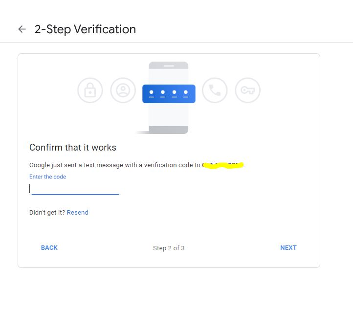

     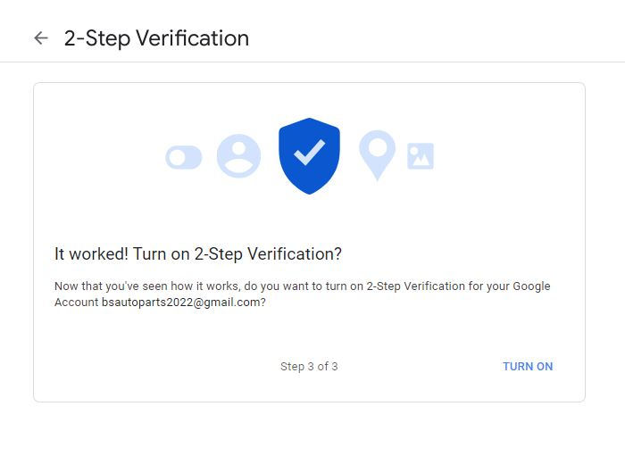

3. Click on app passwords, select Other as the app and give the password a name, for example Django

     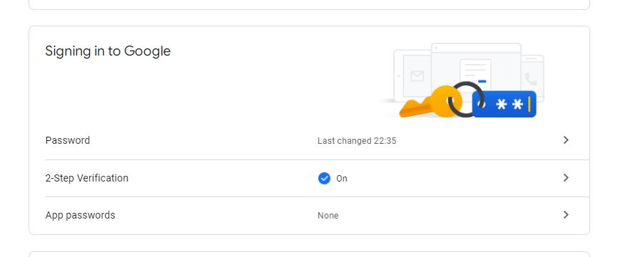

     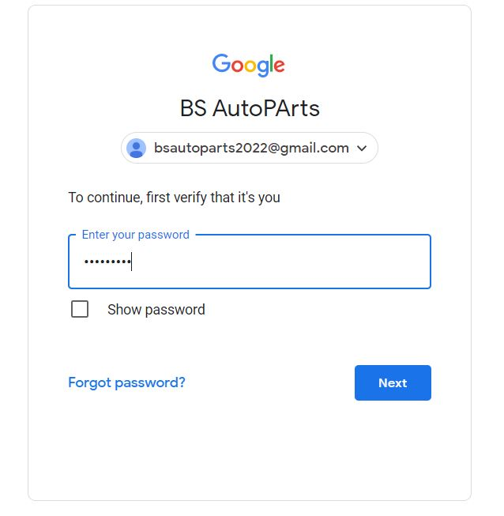

     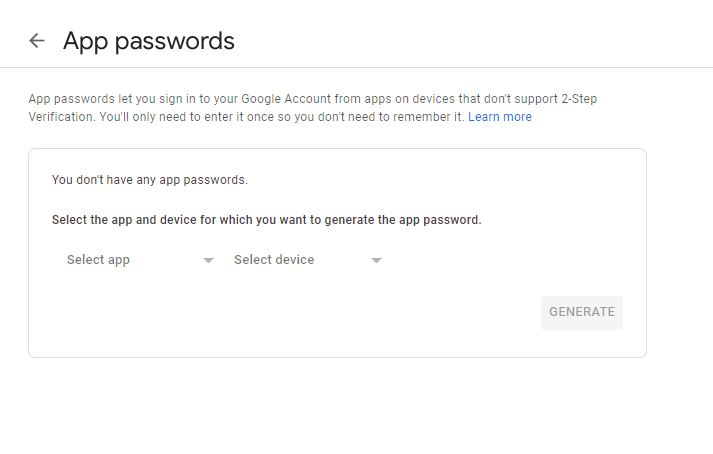

     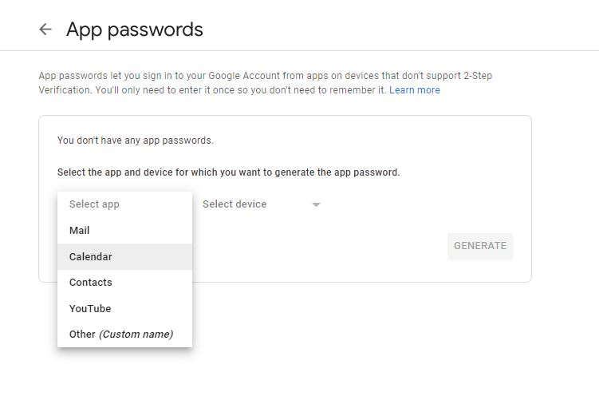

     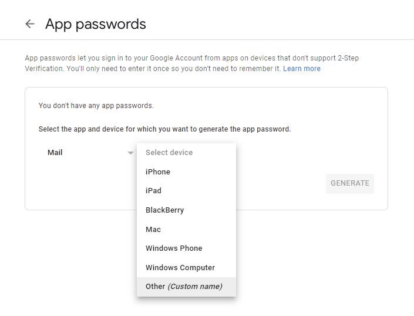

     

4. Click create and a 16 digit password will be generated, note the password down
     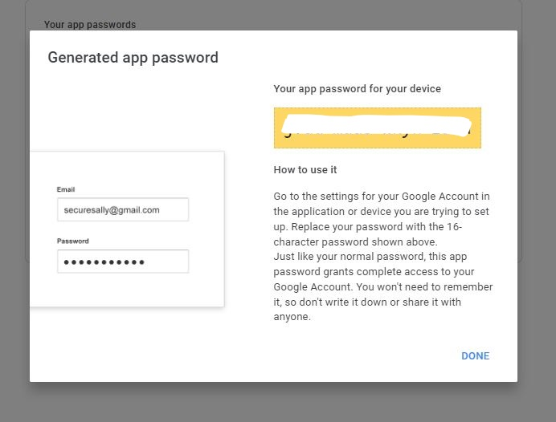

5. In the Heroku navigate to the settings tab and reveal config vars
     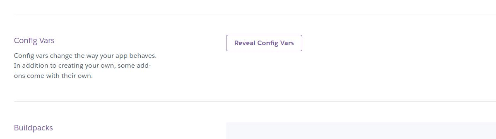

5. In the Heroku config vars create an environment variable called EMAIL_HOST_PASS with the 16 
   digit password
     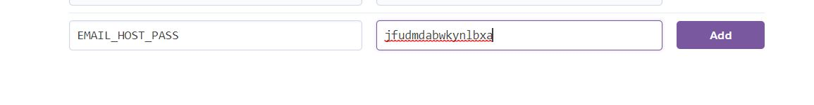

6. In the Heroku config vars create an environment variable called EMAIL_HOST_USER with the email address of the gmail account
     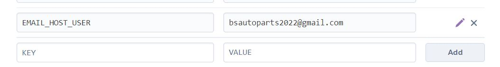

7. In your workspace navigate to the top level settings.py file to update the email settings
     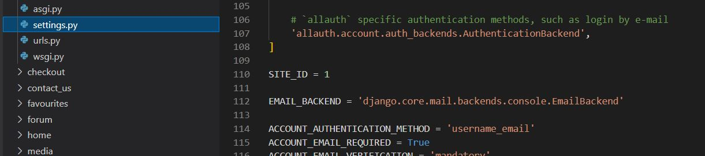

8. Set and confirm the following values in the settings.py file to successfully send emails
     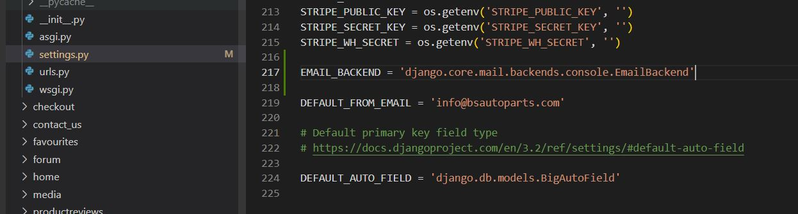

