# DEPLOYMENT TO HEROKU

## Deployment steps:

#### Step 1: Select Create a New Heroku Account

#### Step 2: Add your Credentials to create an account
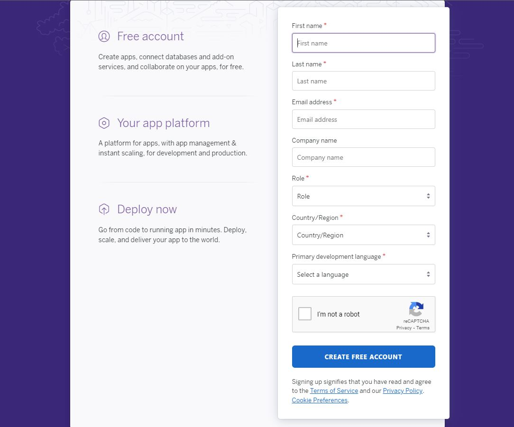

#### Step 3: Once an account is created go to the dashboard 

#### Step 4: Select New to create a new app
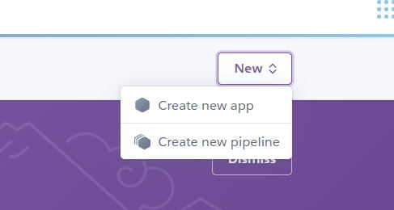

#### Step 5: Add your app name and select the region you are closest to
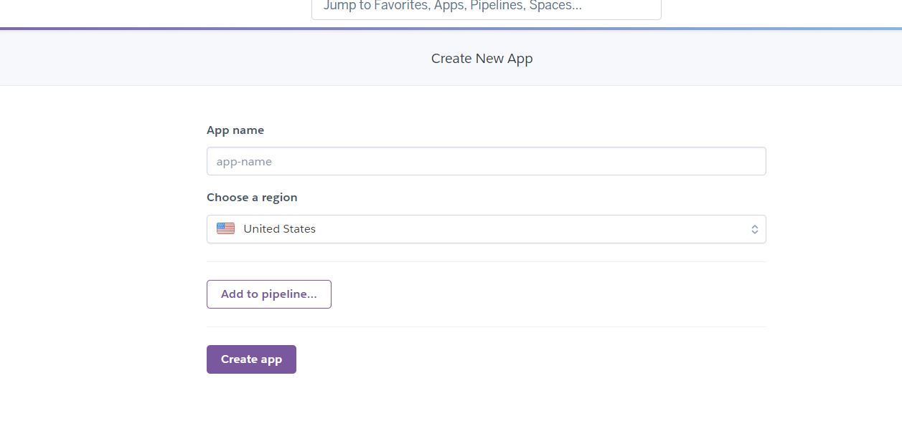

#### Step 6: In the example below we have created our app name and selected Europe as our region

#### Step 7: Once your app is created you will be returned to the dashboard of your new app
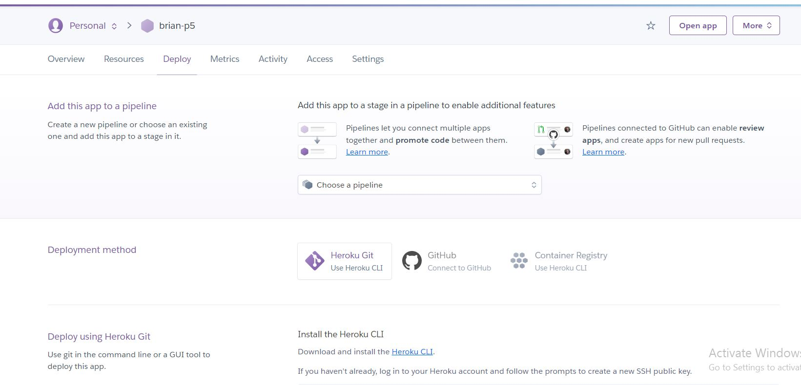

#### Step 8: Select the Deploy tab from the top menu

#### Step 9: Add a pipeline to deploy from or connect to a github account
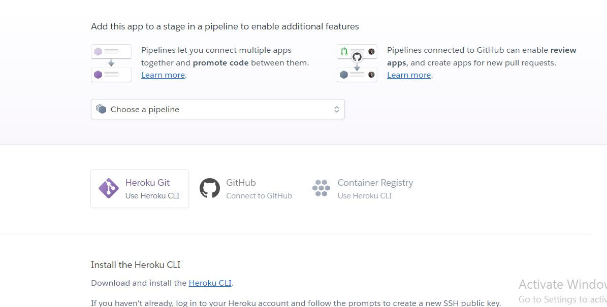

#### Step 10: You can select a github account and repository to connect to.
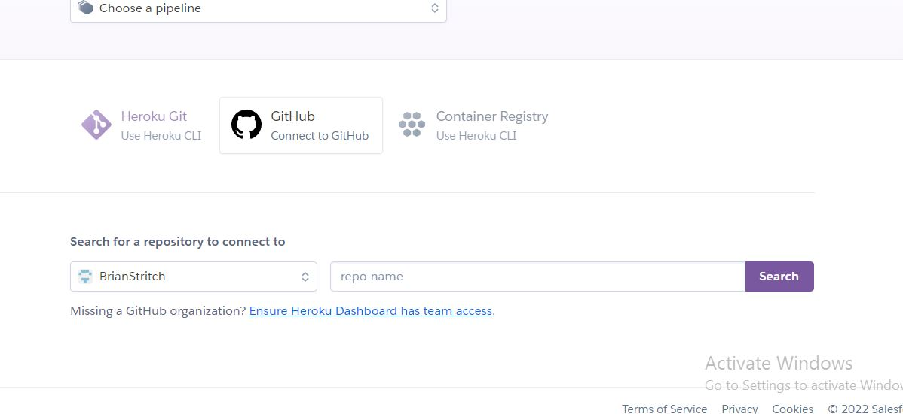

#### Step 11: In the example below we can see the github account and selected repository to connect to.
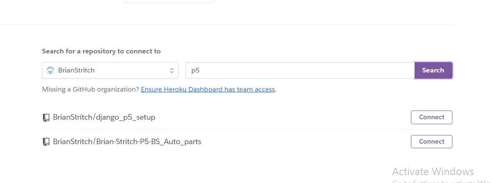

#### Step 12: Next we enabled Automatic Deploys and Deployed a branch to begin the process
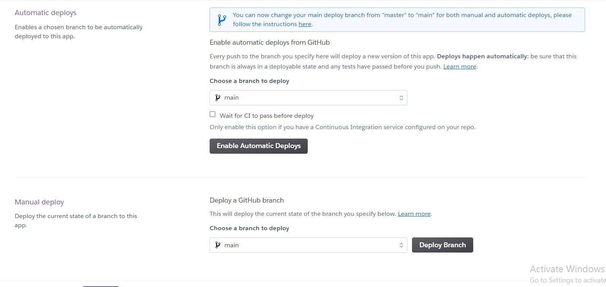

#### Step 13: The Automatic deploys have been activated and the tab is now toggled to disable automatic deployment indicating that it was succesful.
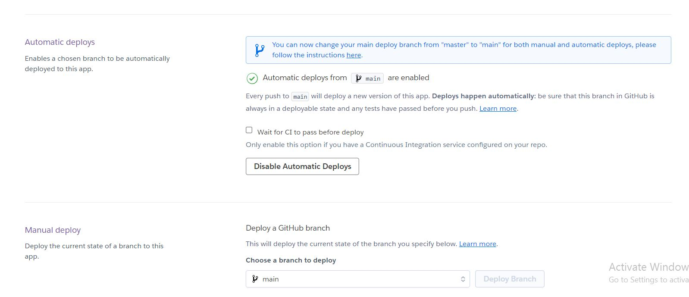

#### Step 14: Next we navigate to the Settings tab

#### Step 15: In the settings section we select REVEAL CONFIG VARS

#### Step 16: Select Reveal config vars in order to set the configuration variables

#### Step 17: Once selected the relevant Key Value pairs can be input and saved
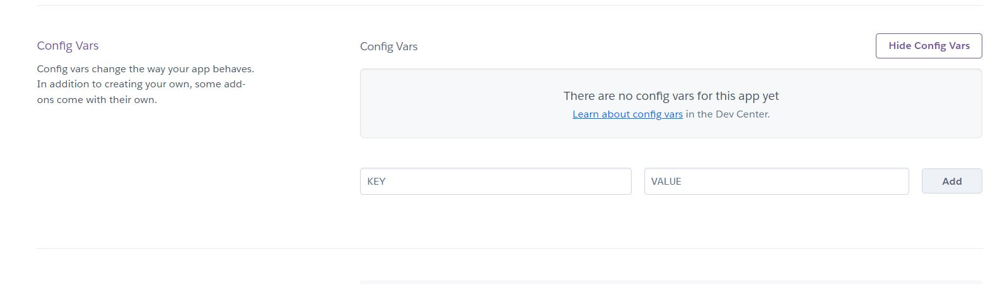

#### Step 18: Below is an image of the required config vars for this project to deploy correctly on heroku.
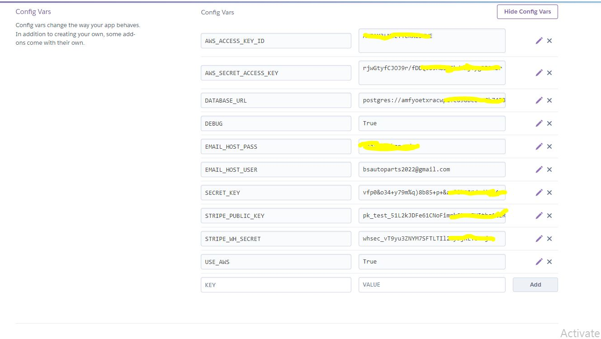

#### Step 19: Next we navigate to the top level of our application in our workspace.
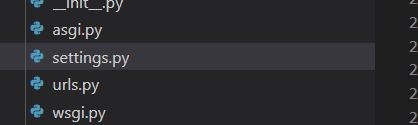

#### Step 20: In the Allowed hosts we now include our herokuapp url to allow our workspace access from heroku.
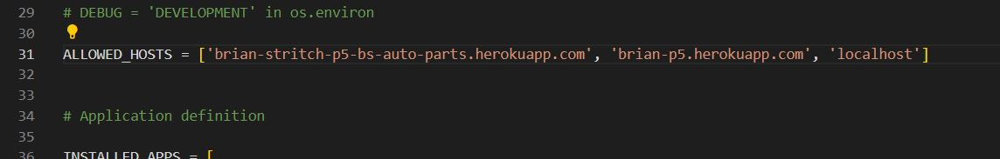

## Installation of heroku in Gitpod and login

#### Step 1: Installation of Heroku in the Workspace Terminal.

    - To Install heroku we used the following commands in the terminal:
         - npm i -g heroku 
         - pip install heroku3

#### Step 2: Login to heroku via the workspace terminal

     - To Login to heroku via the workspace terminal we used the following command:
         - heroku login -i 

## We have now completed our Heroku Deployment
