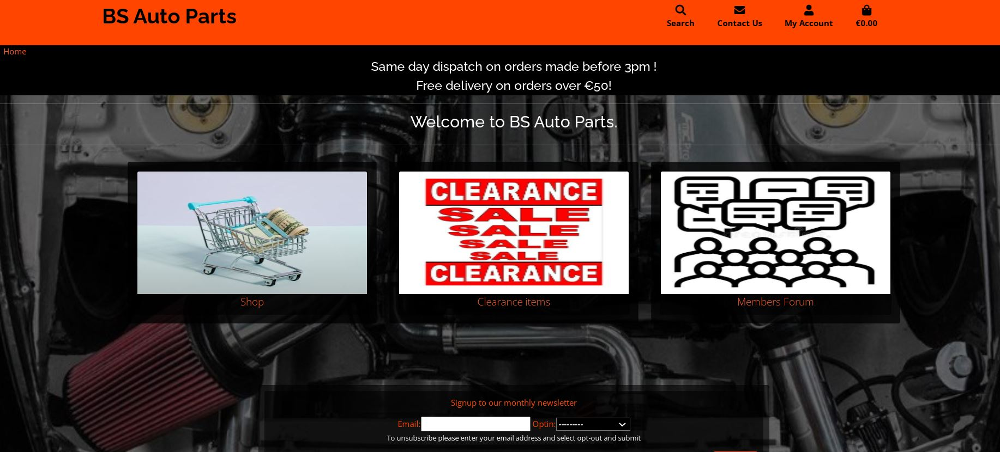
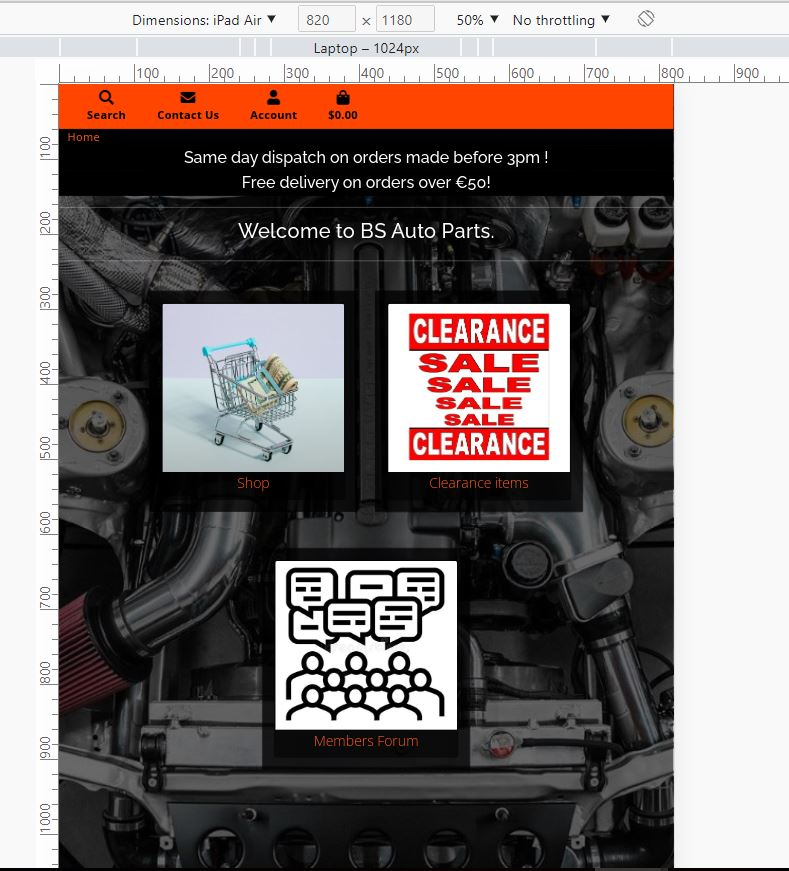
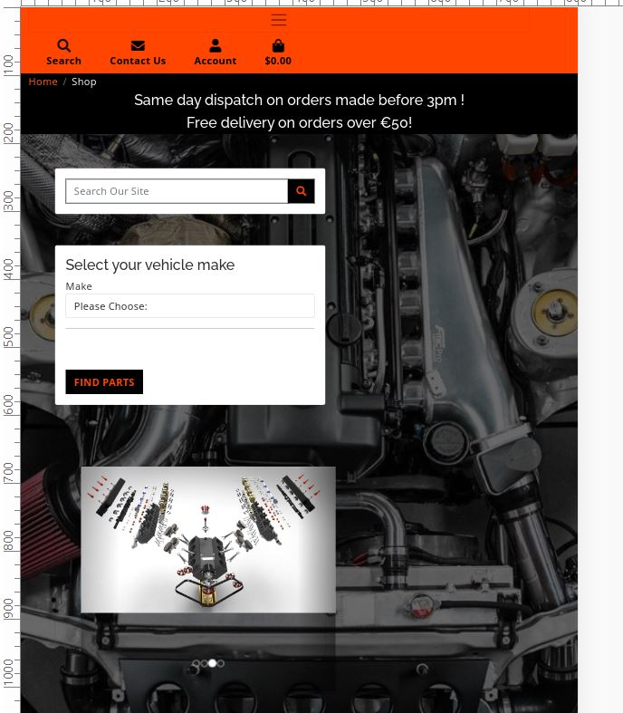
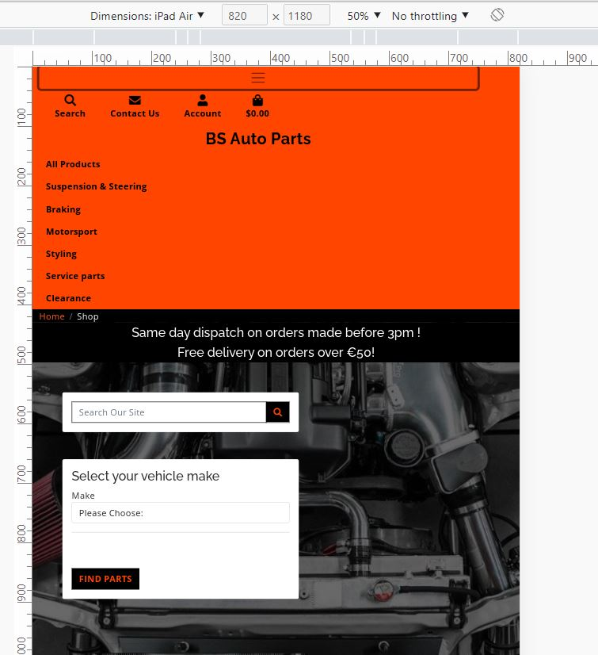
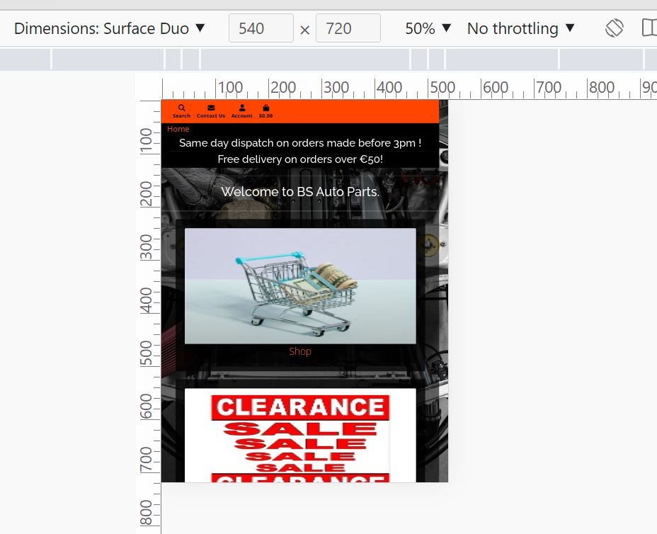
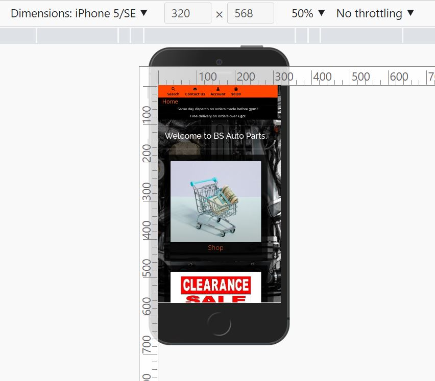
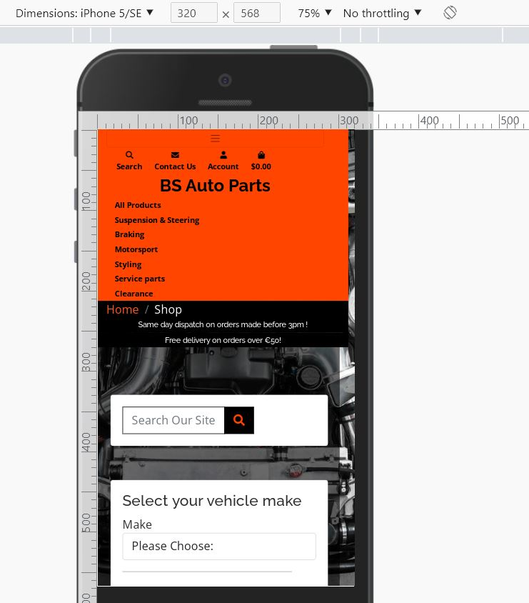

# RESPONSIVENESS OF APPLICATION

In order to ensure that the navigation bar was as responsive as possible, on Desktop the menu shows accross the top of the page while on mobile screens, the menu reduced to a burger icon wide visible button. When the burger icon is clicked, the menu appears as a dropdown with the links to other pages from the nav bar. 

On the Forum page there is an additional nav bar which contains the links to return to the main site as the main shop navigation is hidden in the Forum Section of the website. 

I Logged in as a staff or superuser,whislt on the forumpages, a link to the forum admin is visible giving the storeowners the ability to add forum topics, and forum categories.

I Logged in as a staff or superuser a link to the store management is available in the user menu at the top of the header giving the storeowners the ability to carry out a multitude of administratin functions such as stock control, viewing messages from users, viewing newsletter subscribers and allowing full access to the django administration panel.

Each page was altered slightly between mobile and desktop for its layout to ensure that the user is getting the best UX possible, regardless of the screen size they are using. This can be seen in the wireframes section as I have included a wireframe of each page with desktop and mobile view. 

##### Desktop Size

##### Tablet Size Screen

##### Tablet Size Screen Navigation Menu

##### Tablet Size Screen Navigation Menu expanded

##### Mobile Size Home Page

##### Mobile Size Page 

##### Mobile Size Home Page Navigation 

##### Mobile Size Home Page Navigation Expanded 

