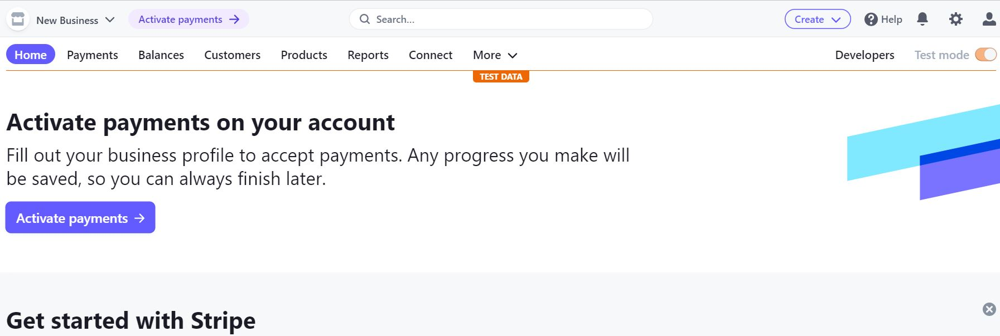
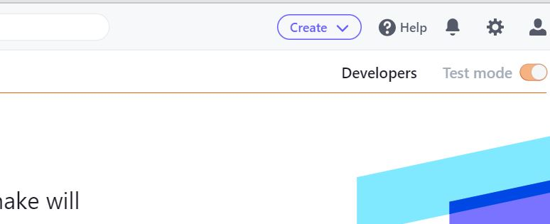
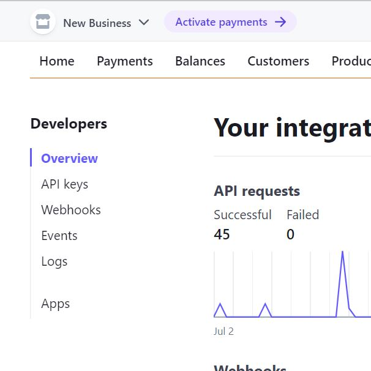
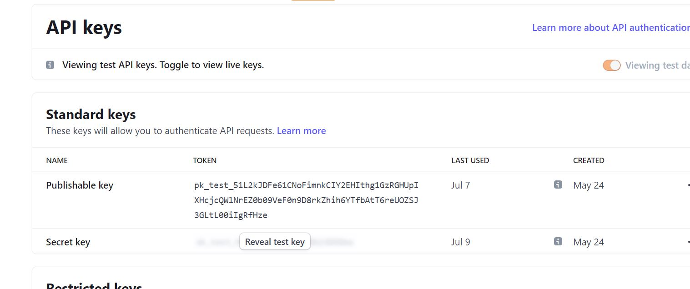
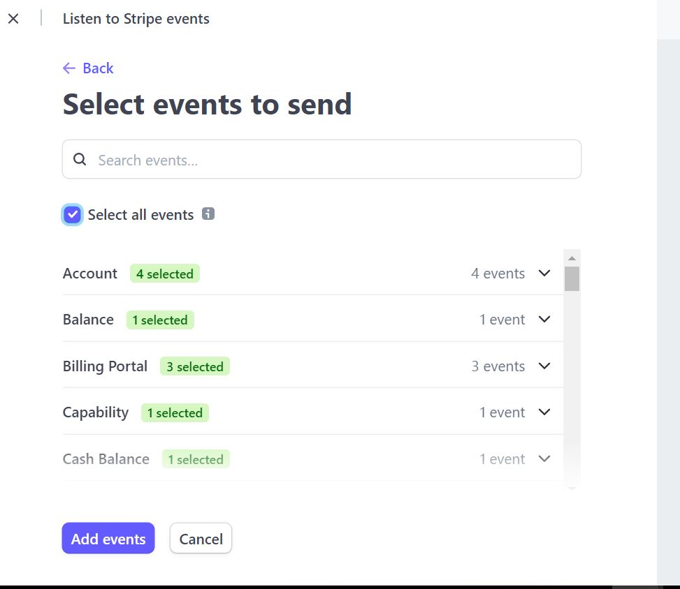

# Stripe setup

## Stripe
1. Register for an account at stripe.com

2. Click on the Developers section of your account once logged in
 
 

3. Under Developers, click on the API keys section
 

4. Note the values for the publishable and secret keys
 

5. In your local environment(env.py) and heroku, create environment variables STRIPE_PUBLIC_KEY and STRIPE_SECRET_KEY with the publishable and secret key values
 <code>os.environ.setdefault('STRIPE_PUBLIC_KEY', 'your new public key')</code>
 <code>os.environ.setdefault('STRIPE_SECRET_KEY', 'your new secret key')</code>

6. Back in the Developers section of your stripe account click on Webhooks
 

7. Create a webhook with the url of your website <url>/checkout/wh/, for example: "https://brian-stritch-p5-bs-auto-parts.herokuapp.com/.herokuapp.com/checkout/wh/"

8. Select the payment_intent.payment_failed and payment_intent.succeeded as events to send
 
9. Note the key created for this webhook
10. In your local environment(env.py) and heroku, create environment variable STRIPE_WH_SECRET with the secret values
<code>os.environ.setdefault('STRIPE_WH_SECRET', 'your new secret webhook key')</code>
