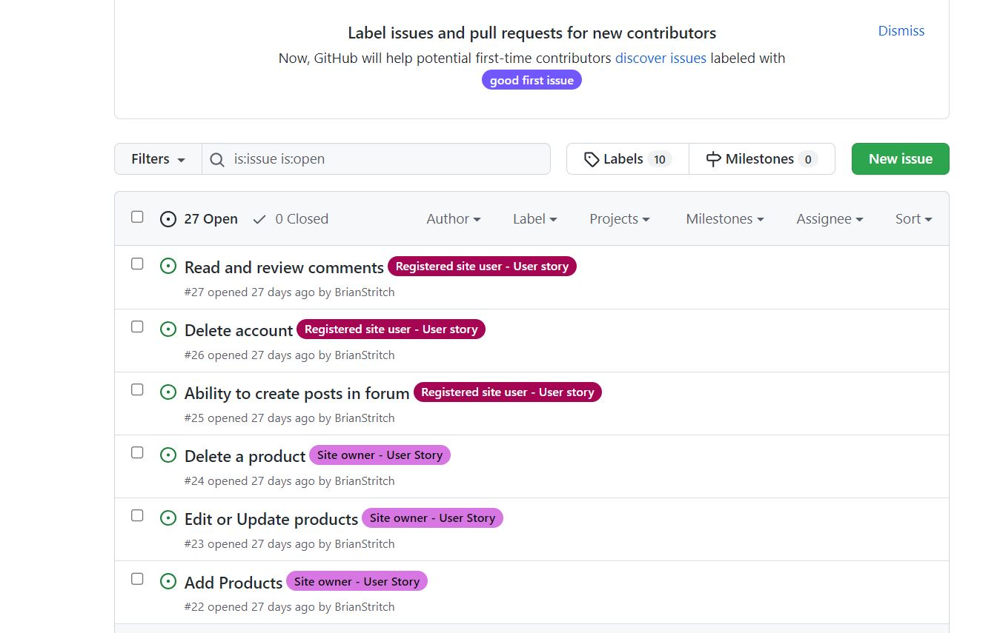
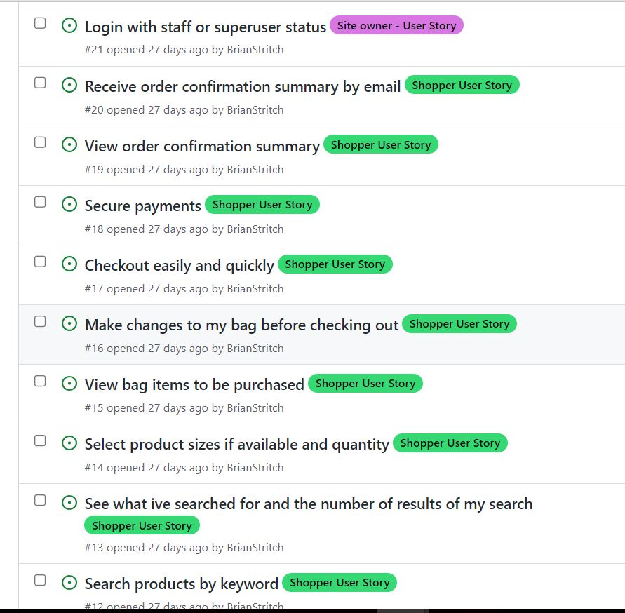
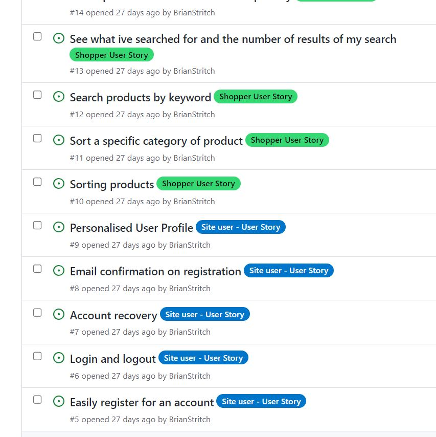
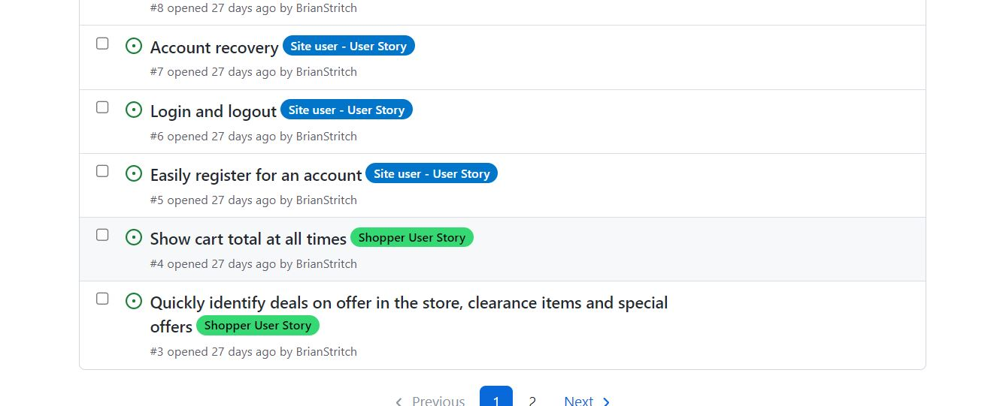
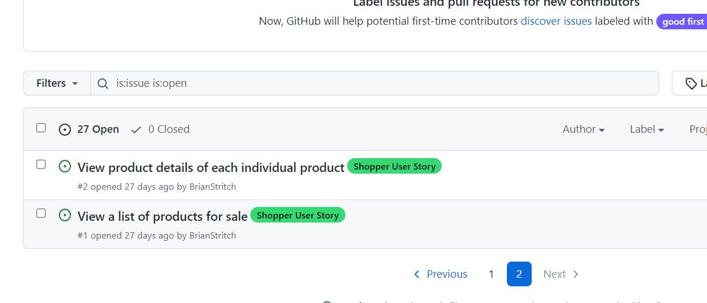
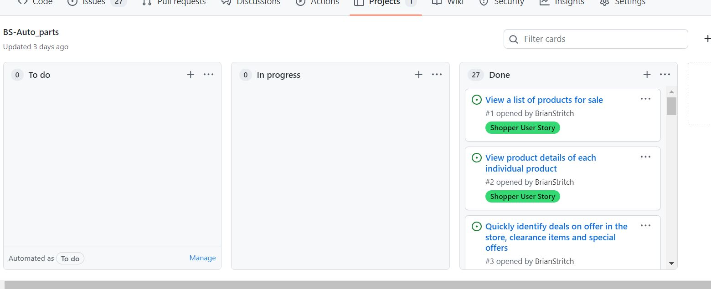

# USER STORIES,GITHUB ISSUES, GITHUB CANBAN BOARD

# Github issues

# Github CanBan Board

Below is a list of views and descriptions ilustrating the different views and functionality available to the site user depending on thier status, ie, staff, regstered user or unregistered guest users, who all have different levels of access depending on thier status.

#### New Users
    - As a new user, I would like to be able to view products in the store 
    - As a new user, I would like to be able to view products in the store and add them to my shopping bag
    - As a new user, I would like to be able to navigate from the products to the shopping bag
    - As a new user, I would like to be able to view the products in the shopping bag easily to check its contents
    - As a new user, I would like to be able to view the ability to easily navigate back to the shop products page from the shopping bag
      in case i wish to purchase more products.
    - As a new user, I would like to be able ammend the quantity of products in my shopping bag in case i wish to purchase more of the
      same  products.
    - As a new user, I would like to be able to navigate from the shopping bag to the checkout page to progress with my purchase.
    - As a new user, I would like to be able to easily enter my shipping details to ensure my order is delivered correctly.
    - As a new user, I would like to be able to easily enter my payment details and confirm my purchase.
    - As a new user, I would like to be able to recieve an order confirmation email which outlines which products i have purchased, their
      prices, the quantity of each item, the cost of each item and the total cost of my order.
    - As a new user, I would like to be able to see reasons why I should create an account so that I can decide if I would like to become
      a member
    - As a new user, I would like to be able to have the ability to register and create an account.  
    - As a new user, I would like to be able to have the ability to sign up for the shop newsletter.
    - As a new user, I would like to be able to have the ability to opt in or out of the newsletter or remove my email from the
      newsletter database should i feel the wish to do so.
    - As a new user, I would like to be able to read reviews on each product so that I can see what other users think of the products on
     offer

#### Existing Members
##### I would like to have all the new users functionality and also:
    - As an existing member, I would like to be able to log into my profile easily so that I can avail of members only attributes of 
      the website such as the forum.
    - As an existing member, I would like to be able to log into my profile easily so that I can review my profile information
    - As an existing member, I would like to be able to edit my personal information on my profile so that I can keep the information
      up to date on the database
    - As an existing member, I would like to be able to delete my profile should i wish to do so

    - As an existing member, I would like to be able to view my previous orders history 
    - As an existing member, I would like to be able to create reviews on products in the store
    - As an existing member, I would like to be able to edit all of my reviews
    - As an existing member, I would like to be able to delete my reviews
    - As an existing member, I would like to be able to like a selected product review 
    - As an existing member, I would like to be able to un-like a selected product review 
    - As an existing member, I would like to be able to view the number of likes on each product review

    - As an existing member, I would like to be able to access the members forum and view all the different posts in each topic and the
      comments on each post. 
    - As an existing member, I would like to be able to create my own forum post
    - As an existing member, I would like to be able to easily view my own forum post
    - As an existing member, I would like to be able to edit all of my forum posts
    - As an existing member, I would like to be able to delete my forum post
    - As an existing member, I would like to be able to like a selected post 
    - As an existing member, I would like to be able to un-like a selected post 
    - As an existing member, I would like to be able to view the number of likes on each post

    - As an existing member, I would like to be able to view all forum post comments 
    - As an existing member, I would like to be able to create my own forum post comments 
    - As an existing member, I would like to be able to view all my forum post comments 
    - As an existing member, I would like to be able to edit all of my forum post comments
    - As an existing member, I would like to be able to delete my forum post comments
    - As an existing member, I would like to be able to view the number of likes on each post comment
    - As an existing member, I would like to be able to like a selected post comment
    - As an existing member, I would like to be able to un-like a selected post comment
   

#### Admin / Staff Users
##### Stock Control
    - As a staff member, I would like to be able to view all the products in the store
    - As a staff member, I would like to be able to add new products to the store
    - As a staff member, I would like to be able to edit all the details of all the products in the store
    - As a staff member, I would like to be able to delete products no longer in the store
    - As a staff member, I would like to be able to easily toggle the sale status of products in the store
    - As a staff member, I would like to be able to view all the product categories in the store
    - As a staff member, I would like to be able to add new product categories  to the store
    - As a staff member, I would like to be able to edit all the details of all the product categories  in the store
    - As a staff member, I would like to be able to delete product categories  no longer required in the store
    - As a staff member, I would like to be able to view all the manufacturer brands suitable for the products in the store
    - As a staff member, I would like to be able to add new manufacturer brands to the store
    - As a staff member, I would like to be able to edit all the details of all the manufacturer brands in the store
    - As a staff member, I would like to be able to delete manufacturer brands no longer required in the store

##### User Management
    - As a staff member, I would like to be able to view all of the users of the website so that I can manage them
    - As a staff member, I would like to be able to edit a users Information should it be required
    - As a staff member, I would like to be able to delete the accounts of registered users in my store if required
    - As a staff member, I would like to be able to be able to grant a user staff access or remove if required
    - As a staff member, I would like to be able to add new members to the store if required

##### Newsletter Subscribers
    - As a staff member, I would like to be able to view all the newletter subscribers in the store
    - As a staff member, I would like to be able to view the newsletter subscribers current status in the store
    - As a staff member, I would like to be able to edit all the newsletter subscribers details 
    - As a staff member, I would like to be able to delete newsletter subscribers no longer subcribed from the database

##### Product Reviews
    - As a staff member, I would like the ability to be able to review all the product reviews prior to publishment for the
      purpose of quality control 
    - As a staff member, I would like to be able to view all the pending product reviews 
    - As a staff member, I would like to be able to view all the published product reviews
    - As a staff member, I would like to be able to view all the reviews
    - As a staff member, I would like to be able to edit any of the reviews if required
    - As a staff member, I would like to be able to delete a review in the event that it contains any offensive or inappropriate content
    - As a staff member, I would like to be able to view all comments on reviews
    - As a staff member, I would like to be able to approve or disprove all comments on reviews in the event that they contain any 
      offensive or inappropriate content
    - As a staff member, I would like to be able to edit any of the comments on a review if required 

##### Forum
###### Posts   
    - As a staff member, I would like the ability to be able to review all the forum posts prior to publishment for the
      purpose of quality control 
    - As a staff member, I would like to be able to view all the pending forum posts 
    - As a staff member, I would like to be able to view all the published forum posts
    - As a staff member, I would like to be able to edit any of the forum posts 
    - As a staff member, I would like to be able to delete any of the forum posts
###### Comments  
    - As a staff member, I would like the ability to be able to review all the forum post comments prior to publishment for the
      purpose of quality control
    - As a staff member, I would like to be able to view all the pending forum posts comments
    - As a staff member, I would like to be able to view all the published forum posts comments
    - As a staff member, I would like to be able to edit any of the forum posts comments
    - As a staff member, I would like to be able to delete any of the forum posts comments
